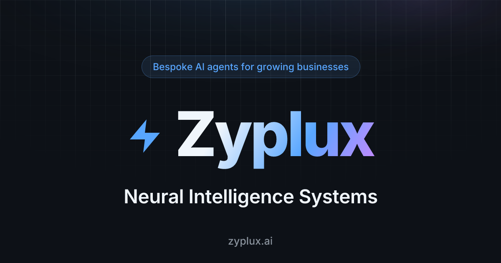

#  zyplux/.github

<div align="center">



**The [Zyplux](https://zyplux.ai) org-wide `.github` repo** — the public organization profile, the reusable Copilot review gate, and the org rulesets as code.

</div>

## What's inside

| Piece                                                 | What it is                                                                    |
| ----------------------------------------------------- | ------------------------------------------------------------------------------ |
| [profile/README.md](profile/README.md)                | Public org profile rendered at [github.com/zyplux](https://github.com/zyplux) |
| [org_gate_base](.github/workflows/org_gate_base.yml)  | Reusable workflow gating merges on a completed Copilot review                  |
| [copilot-review-gate](apps/copilot-review-gate)       | The app behind org_gate_base — records the review verdict as a commit status   |
| [apply-org-rulesets](apps/apply-org-rulesets)         | Applies the org rulesets across every repo                                    |
| [rulesets](rulesets)                                  | Baseline protections and selectively applied Copilot review rules            |

## Reusable CI: org_gate_base

Watches the GitHub Copilot pull-request review and records it on a requireable `copilot-review-complete` commit status (see [docs](apps/copilot-review-gate/README.md)). A clean review records `success`; unresolved Copilot comments record `failure`, blocking the merge until they are resolved. Every org repo that the `copilot-review` ruleset covers must call it, or its PRs block forever on the missing status.

The `copilot-review` ruleset requests reviews on new pushes to non-draft pull requests.

Add `.github/workflows/org_gate.yml` to the consuming repo:

```yaml
name: org_gate

on:
  pull_request:
    types: [opened, reopened, synchronize, ready_for_review]

permissions:
  statuses: write
  checks: read
  pull-requests: read

jobs:
  org_gate_base:
    uses: zyplux/.github/.github/workflows/org_gate_base.yml@main
```

## Organization rulesets

`default-branch-baseline` requires CI, one approving review, code-owner review, resolved review threads, and squash merges for every repository. It also protects the default branch from deletion and force pushes.

`copilot-review` adds automatic Copilot reviews and the required `copilot-review-complete` status for every repository except `zyp-vps-configs`.

Apply the version-controlled rules with `just apply-org-ruleset`. Files are applied alphabetically, so the Copilot ruleset is installed before the baseline relinquishes those requirements. After applying the exemption, remove `org_gate.yml` from `zyp-vps-configs`; its CI and human-review requirements remain active.
