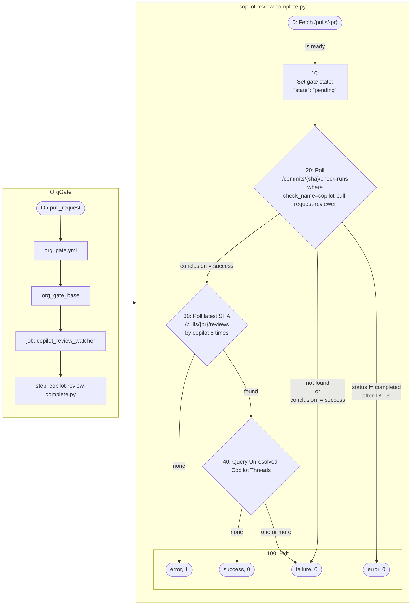

# Copilot review gate

This workflow converts GitHub Copilot's PR review into the `copilot-review-complete` commit status. Repository rules can require this status together with `ci` and GitHub's resolved-thread rule.

The gate waits for a ready PR, observes Copilot's check-run and review for the current head commit, counts unresolved Copilot threads, and publishes the resulting status.

## Org Gate

*How does a PR event start the watcher and produce the `copilot-review-complete` status?*



## Workflow entry point

[org_gate_base.yml](../../.github/workflows/org_gate_base.yml), calls [copilot_review_complete.py](src/copilot_review_gate/copilot_review_complete.py) with:

- `REPO`: `owner/repository`
- `PR`: PR number
- `SHA`: current PR head commit
- `GH_TOKEN`: workflow token with `checks: read`, `pull-requests: read`, and `statuses: write`

The workflow starts from PR events and reads live GitHub state throughout the run, giving Copilot's workflow-created activity a reliable watcher.

## State read from GitHub

| State | Request | Fields and condition |
|---|---|---|
| 100: PR is ready | `GET /repos/{repo}/pulls/{pr}` | Ready when `draft` is `false`. |
| 120: Poll Copilot check-runs | `GET /repos/{repo}/commits/{sha}/check-runs?check_name=copilot-pull-request-reviewer&per_page=100` | Select `check_runs[]` where `name` is `copilot-pull-request-reviewer`. |
| Copilot check-run completed | Same check-runs request | Complete when `status` is `completed`. Then read `conclusion` and `details_url`. |
| 130: Poll copilot reviews | `GET /repos/{repo}/pulls/{pr}/reviews?per_page=100` | Submitted when a review has `commit_id == SHA` and `user.login` contains `copilot`, case-insensitively. |
| 140: Query **Unresolved Copilot Threads** | `POST /graphql` | Count a thread when `isResolved` is `false` and its first comment's `author.login` contains `copilot`. |

Review submission is detected when the matching review record appears in the reviews response.

The exact **140: Unresolved Copilot Threads** query is:

```graphql
query($owner: String!, $name: String!, $number: Int!) {
  repository(owner: $owner, name: $name) {
    pullRequest(number: $number) {
      reviewThreads(first: 100) {
        nodes {
          isResolved
          comments(first: 1) {
            nodes {
              author {
                login
              }
            }
          }
        }
      }
    }
  }
}
```

The reviews request and thread query intentionally read at most 100 records, well above normal Copilot review volume.

## Check completion and review submission are separate

GitHub exposes the check-run completion time as `check_runs[].completed_at` and the review submission time as `reviews[].submitted_at`. The gate synchronizes on the matching review record; the timestamps remain available for diagnosis.

Copilot can complete its check-run before its review record and comments become visible. Two reviews on [zyplux/zyplux#35](https://github.com/zyplux/zyplux/pull/35) showed gaps of three and four seconds. The gate therefore waits for the matching review record before it counts threads.

## Wait limits

| State | Frequency | Maximum wait |
|---|---:|---:|
| PR becomes ready | Every 5 seconds | About 200 seconds |
| Copilot check-run appears | Every 15 seconds | About 180 seconds |
| Copilot check-run completes | Every 15 seconds | About 30 minutes |
| Matching Copilot review appears | Every 5 seconds | About 30 seconds |

The watcher job has a 40-minute timeout to allow for checkout, the other wait phases, and GitHub API requests alongside the completion window.

## Status written to GitHub

Once the PR is ready, the gate first publishes `copilot-review-complete=pending`. It then publishes the final result with `POST /repos/{repo}/statuses/{sha}` using `context`, `state`, `description`, and, when available, the check-run's `details_url` as `target_url`.

Exit code `0` means the gate reached a definite result, including a definite blocking result. Exit code `1` means it could not read enough GitHub state to make the normal decision.

After resolving Copilot threads, run `just pr`. A push requests a new review for the new head commit; when no push is needed, `just pr` refreshes the gate so it can count the newly resolved threads.
